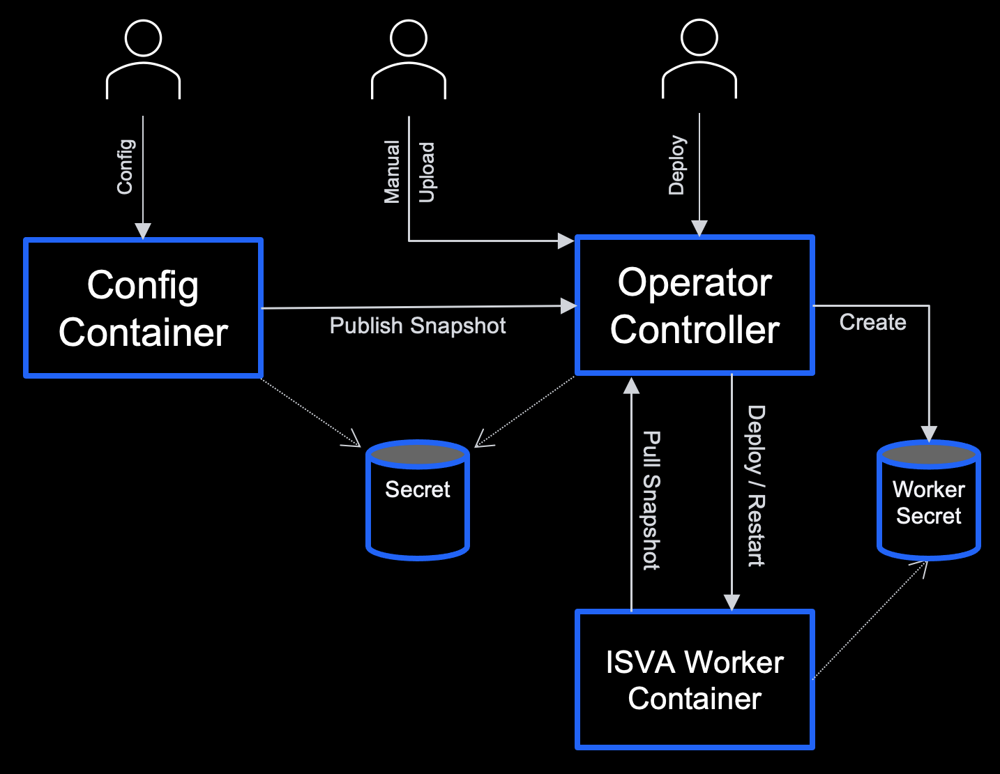

# IBM Verify Identity Access Operator
  * [Overview](#overview)
  * [Installation](#installation)
    + [RedHat OpenShift Environment](#redhat-openshift-environment)
    + [Standard Kubernetes Environment](#standard-kubernetes-environment)
      - [OperatorHub.io and the Operator Lifecycle Manager](#operatorhubio-and-the-operator-lifecycle-manager)
        * [Installing](#installing)
      - [Manual Installation](#manual-installation)
  * [Usage](#usage)
    + [Secrets](#secrets)
    + [Snapshot Management](#snapshot-management)
      - [GET](#get)
      - [POST](#post)
      - [DELETE](#delete)
    + [Partitioning the Cluster](#partitioning-the-cluster)
    + [Deploying a Container](#deploying-a-container)
      - [Container Defaults](#container-defaults)
    + [Creating a Service](#creating-a-service)

## Overview

In a world of highly fragmented access management environments, [IBM Verify Identity Access](https://www.ibm.com/au-en/products/verify-access) helps you simplify your users' access while more securely adopting web, mobile and cloud technologies. This solution helps you strike a balance between usability and security through the use of risk-based access, single sign-on, integrated access management control, identity federation and its mobile multi-factor authentication capability, IBM Verify. Take back control of your access management with IBM Verify Identity Access.

For a detailed description of IBM Verify Identity Access refer to the [Official documentation](https://www.ibm.com/docs/en/sva).

The IBM Verify Identity Access operator provides lifecycle management of the lightweight containers which are used to protect an environment, namely:

* [Web Reverse Proxy](https://www.ibm.com/docs/en/sva/latest?topic=support-docker-image-verify-access-web-reverse-proxy)
                                                                        ds-docker-image-verify-identity-access-web-reverse-proxy
* [Runtime](https://www.ibm.com/docs/en/sva/latest?topic=support-docker-image-verify-access-runtime)
                                                            support-docker-image-verify-identity-access-runtime
* [Distributed Session Cache](https://www.ibm.com/docs/en/sva/latest?topic=support-docker-image-verify-access-distributed-session-cache)

The operator will manage the deployment of these lightweight IBM Verify Identity Access worker containers, and also control the rolling restart of these containers when a configuration snapshot is updated, as depicted in the following figure.



Some points to note about the figure:

* The configuration snapshot is ‘owned’ by an external entity (e.g. configuration container) but is cached by the operator controller.
* When an administrator publishes a new configuration snapshot using the configuration container, the LMI can automatically send the snapshot to the operator controller.  The publishing of the snapshot can also potentially be a manual step.
* When a new configuration snapshot is uploaded the operator controller will perform a rolling restart on all deployments which it has created.  
* The worker containers will pull the configuration snapshot from the operator controller during bootstrapping.
* The Kubernetes Secret holds authentication information used to control access to the snapshot.  It will be automatically created when the controller is first deployed, and will be populated with random credentials.  


## Installation

### RedHat OpenShift Environment

The IBM Verify Identity Access Operator is available from the RedHat community operator catalog.  Information on how to install a community operator in OpenShift can be obtained from the official RedHat OpenShift documentation.

### Standard Kubernetes Environment

In a standard (i.e. non-OpenShift) Kubernetes environment the operator can be installed and managed manually, or it can be installed and managed using the [Operator Lifecycle Manager](https://github.com/operator-framework/operator-lifecycle-manager) and [OperatorHub.io](https://operatorhub.io/). 

#### OperatorHub.io and the Operator Lifecycle Manager

Kubernetes operators are very useful tools that provide lifecycle management capabilities for many varying custom objects in Kubernetes. [OperatorHub.io](https://operatorhub.io/) provides a single place where Kubernetes administrators or developers can go to find existing operators that may provide the functionality that they require. 

The information provided by [OperatorHub.io](https://operatorhub.io/) allows the Operator Lifecycle Manager (OLM) to manage the operator throughout its complete lifecycle. This includes the initial installation and subscription to OperatorHub.io such that updates to the operator can be performed automatically.

##### Installing

To install the IBM Verify Identity Access operator from OperatorHub.io:

1. Access the [IBM Verify Identity Access operator page on OperatorHub.io](https://operatorhub.io/operator/ibm-security-verify-access-operator) in a browser.

2. Click the Install button on the page and follow the installation instructions.

3. Ensure that the IBM Verify Identity Access operator has been created by the Operator Lifecycle Manager. The phase should be set to "Succeeded". Note that this may take a few minutes.

```shell
kubectl get csv -n operators

NAME                              DISPLAY                               VERSION   REPLACES   PHASE
verify-access-operator.v24.12.0   IBM Verify Identity Access Operator   24.12.0              Succeeded
``` 

At this point the Operator Lifecycle Manager has been installed into the Kubernetes cluster, the IBM Verify Identity Access operator has been deployed and a subscription has been created that will monitor for any updates to the operator on OperatorHub.io. The IBM Verify Identity Access operator is now operational and any subsequent custom resources of the kind "IBMSecurityVerifyAccess" will result in the operator being invoked to create the deployment.

#### Manual Installation

The IBM Verify Identity Access operator in essence is made up of 2 components:

1. The custom resource definition
2. The controller application

Each of these needs to be deployed into the Kubernetes environment before the operator can function.  The definitions for these resources are published with the IBM Verify Identity Access Operator GitHub release in a single `bundle.yaml` file.  

To see a list of available releases refer to the releases page in GitHub: [https://github.com/IBM-Security/verify-access-operator/releases](https://github.com/IBM-Security/verify-access-operator/releases).

The following command can be used to deploy the operator directly from the definition published to GitHub:

```shell
kubectl create -f https://github.com/IBM-Security/verify-access-operator/releases/download/v24.12.0/bundle.yaml
```
After executing this command the operator will be deployed to a newly created namespace: `verify-access-operator-system`.  The following command can be used to validate that the operator has been deployed correctly.  The available field should be set to "1". Note that this may take a few minutes.

```shell
kubectl get deployment -n verify-access-operator-system
NAME                                        READY   UP-TO-DATE   AVAILABLE   AGE
verify-access-operator-controller-manager   1/1     1            1           21s
```
At this point the IBM Verify Identity Access operator has been deployed and is operational.  Any subsequent custom resources of the kind "IBMSecurityVerifyAccess" will result in the operator being invoked to create the deployment.


## Usage

### Secrets

A Kubernetes secret, named `verify-access-operator`, is used by the operator controller to store sensitive information.  This includes the following fields:

| Field | Description
| ----- | -----------
| url | The url which is used to access the snapshot manager Web service.  This should always be: `https://verify-access-operator-controller-manager-snapshot-service.<namespace>.svc.cluster.local:7443`
| user | The name of the user which should be used to access the snapshot manager Web service.
| ro.pwd | The password which can be used to access the snapshot manager Web service for read requests.
| rw.pwd | The password which can be used to access the snapshot manager Web service for read/write requests.
| tls.cert | The server certificate which is used by the snapshot manager Web service.
| tls.key | The private key which is used by the snapshot manager Web service.

When the operator controller first starts it will create the secret with random passwords and a self-signed certificate, but only if the secret does not already exist.  If you wish to use your own passwords and server certificate you should create the `verify-access-operator` secret in the namespace in which the operator will be installed and pre-populate this secret with the required fields, before the operator is first deployed.

When a new worker container is deployed the operator controller will examine the destination namespace, and if a `verify-access-operator` secret is not already available in that namespace it will create a new secret to house the user, ro.pwd and url fields.

### Snapshot Management

The operator controller provides a Web service which can be used to store configuration snapshots for use by the managed worker containers.  The Web service will be available in the cluster at the following URL:

`https://verify-access-operator-controller-manager-snapshot-service.<namespace>.svc.cluster.local:7443`

A basic authentication (BA) header should be provided with each Web service request to authenticate the client.  The name of the user which should be included in the BA header can be obtained from the `user` field within the `verify-access-operator` secret.  The user has two different passwords, one which can be used for all operations (i.e. GET/POST/DELETE), and another which can only be used for read operations (i.e. GET).  Both passwords will be present in the `verify-access-operator` secret, with the former contained within the `ro.pwd` field, and the later contained within the `rw.pwd` field.

All configuration snapshots are contained within the `/snapshots` path, and all fix-packs (which can also be managed by the snapshot manager) are contained in the `/fixpacks` path.

The following sections describe the various methods which can be used to access the snapshot manager Web service.  In each of the examples provided the following environment variables have been set based on the specified field within the `verify-access-operator` secret:

| Environment Variable | Secret Field
| -------------------- | ------------
| URL | url
| USER | user
| RO_PWD | ro.pwd
| RW_PWD | rw.pwd
 

#### GET

The GET method can be used to retrieve a specific snapshot.   An example curl command which can be used to retrieve a snapshot is as follows:

```shell
curl -k -u $USER:$RO_PWD -O $URL/snapshots/ivia_10.0.5.0_published.snapshot
```

#### POST

The POST method can be used to upload a new snapshot to the snapshot manager. An optional `modified` query argument can be added to the URL as a comma-separated list of services which should be restarted as a result of the update.  If the `modified` query string argument is not present all managed deployments will be restarted. 

The service names used in the `modified` query string argument is as follows:

|Service|Value
|-------|-----
|Distributed Session Cache | dsc:\<dsc number>, for example: `dsc:1`
|Runtime | runtime
|Web Reverse Proxy | wrp:\<instance name>, for example: `wrp:default`

An example curl command which can be used to upload a new snapshot is as follows:

```shell
curl -k -u $USER:$RW_PWD -F 'file=@/var/shared/snapshots/ivia_10.0.5.0_published.snapshot' $URL/snapshots/ivia_10.0.5.0_published.snapshot?modified=wrp:default,runtime
```

#### DELETE

The DELETE method can be used to delete a specific snapshot.  An example curl command which can be used to delete a snapshot is as follows:

```shell
curl -k -u $USER:$RW_PWD -X DELETE $URL/snapshots/ivia_10.0.5.0_published.snapshot
```

### Partitioning the Cluster
It is important to be able to partition the environment so that the same Kubernetes cluster can be used for test/development/production/etc.  To this end a snapshot identifier can be specified when deploying a new worker container - this is an optional part of the custom resource definition of the operator.  

The name of the snapshot which is used by the container is then constructed from the snapshot identifier, as: `ivia_<version>_<snapshot-id>.snapshot`
     
The operator will be able to store multiple snapshots, and on a snapshot update will only perform a rolling restart on those deployments which are using the updated snapshot.

The configuration container can also be configured to use a snapshot with a specific ID by setting the `SNAPSHOT_ID` environment variable.


### Deploying a Container

In order to deploy a worker container using the operator a new IBMSecurityVerifyAccess custom resource must be created in the environment. 

The following example (ivia-wrp.yaml) shows the custom resource for a new worker container:

```yaml
apiVersion: ibm.com/v1
kind: IBMSecurityVerifyAccess

metadata:
  # The name which will be give to the deployment.
  name: ivia-sample

spec:
  # The name of the image which will be used in the deployment.
  image: "icr.io/ivia/ivia-wrp:11.0.0.0"

  # The number of pods which will be started for the deployment.
  replicas: 1

  # A boolean flag which indicates whether the deployment should be
  # restarted when a new snapshot is published.
  autoRestart: true

  # A string which is used to indicate the identifier of the snapshot which
  # should be used by the deployment.  If no identifier is specified a default
  # snapshot of 'published' will be used.
  snapshotId: published

  # An array of strings which indicate the name of fixpacks which should
  # be installed in the deployment.  This corresponds to setting the
  # FIXPACKS environment variable in the deployment itself.
  #
  # fixpacks:
  #   - "test.fixpack"

  # The name of the Verify Identity Access instance which is being deployed.  This value
  # is only used for WRP and DSC deployments and is ignored for Runtime
  # deployments.  
  instance: default

  # The language which will be used for messages which are logged by the
  # deployment.
  language: "en_US.utf8"

  # The list of volumes that can be mounted by containers belonging to
  # the pod.  More info can be found at:
  #     https://kubernetes.io/docs/concepts/storage/volumes
  volumes:
    - name: ivia-config
      emptyDir: {}

  # The list of references to secrets in the same namespace to use for the
  # pulling of the Verify Identity Access image.
  # imagePullSecrets:
  #   - name:my-secret

  # The name of the ServiceAccount to use to run the managed pod.
  # serviceAccountName: "default"

  # The X509 certificate to verify the connection to the configuration snapshot
  # service. The default value for this property is "operator", which reads the "tls.cert"
  # value from the verify-access-operator secret created in the namespace that the Verify Identity 
  # Access pods are deployed to.
  snapshotTLSCacert: "operator"


  # The IBM License Metric Tool annotations to add to the runtime container. These annotations a required
  # by IBM to track license useage for the IBM Verify Identity Access product. Administartors have the option
  # of using licence codes for WebSEAL, Advanced Access Cotnrol, Federation or Enterprise; as well as production
  # or non-production (development) licenses. The actual license codes you should deploy will depend on your 
  # licensing agreement with IBM.
  ilmtAnnotations:
    module: webseal
    production: true

  # Administarators can optionally set additional annotations to add to deployed Verify Identity Access runtime
  # containers. This may be used for integration with third party applications such as log aggregation 
  # or infrastructure monitoring tools. Character restrictions for custom annotations are the same for
  # any other Kubernets annotation.
  # More info can be found at:
  #     https://kubernetes.io/docs/concepts/overview/working-with-objects/annotations/#syntax-and-character-set
  customAnnotations:
  - key: my.custom/Annotation
    value: annotationToAdd


  # The ordered list of secrets used to decrypt configuration snapshot files. This
  # property is required if the configuration snapshot file being used was encrypted
  # when it was created.
  snapshotSecrets: "secreteToDecryptSnapshotFiles||AnotherSecretToDecryptFiles"

  # Any specific container information which is associated with this
  # container.  The container options include:
  #    env
  #    envFrom
  #    resources
  #    volumeMounts
  #    volumeDevices
  #    livenessProbe
  #    readinessProbe
  #    startupProbe
  #    imagePullPolicy
  #    securityContext
  #
  # Default values will be provided for the probes and security context.
  #
  # More info can be found at:
  #   https://kubernetes.io/docs/tasks/configure-pod-container
  container:
    env:
      - name: TEST_ENV
        value: TEST_ENV_VALUE
```

The following command can be used to create the deployment from this file:

```shell
kubectl apply -f ivia-wrp.yaml
```

#### Container Defaults

The following labels will be automatically created in the worker container deployment:

|Label|Value
|-----|-----
|kind|IBMSecurityVerifyAccess
|app|The metadata.name field from the CR.
|VerifyAccess_cr|The metadata.name field from the CR.

In addition to this, the following default fields will be automatically set, if they are not overridden in the CR:

```
spec:
  selector:
    matchLabels:
      <labels>
      
  template:
    containers:
      - env:
        - name: CONFIG_SERVICE_URL
          valueFrom:
            secretKeyRef:
              key: url
              name: verify-access-operator
              optional: false
              
        - name: CONFIG_SERVICE_USER_NAME
          valueFrom:
            secretKeyRef:
              key: user
              name: verify-access-operator
              optional: false
              
        - name: CONFIG_SERVICE_USER_PWD
          valueFrom:
            secretKeyRef:
              key: ro.pwd
              name: verify-access-operator
              optional: false

        livenessProbe:
          exec:
            command:
            - /sbin/health_check.sh
            - livenessProbe
          timeoutSeconds: 3

        startupProbe:
          exec:
            command:
            - /sbin/health_check.sh
            - startupProbe
          failureThreshold: 30
          initialDelaySeconds: 5
          timeoutSeconds: 20
                    
        readinessProbe:
          exec:
            command:
            - /sbin/health_check.sh
          timeoutSeconds: 3
                    
        ports:
        - containerPort: 9443
          name: https
          protocol: TCP

        securityContext:
          runAsNonRoot: true
          runAsUser: 6000


```

### Creating a Service

When creating a service for the deployed worker container the selector for the service must match the selector for the deployment, most commonly achieved by specifying the `app` label.  

An example NodePort service definition is provided below:

```
apiVersion: v1
kind: Service
metadata:
  name: ivia-sample
spec:
  ports:
    - port: 9443
      name: ivia-sample
      protocol: TCP
      nodePort: 30443
  selector:
    app: ivia-sample
  type: NodePort
```
